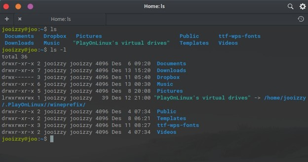

CLI (Command Line Interface) sudah tidak asing lagi kita lihat bagi pecinta kejuruan IT, kita sering melihatnya di film-film hacker ataupun yang lainnya. Sangat familiar melihat seorang yang jago IT melakukan hal ini yaitu memasukan sebuah command-command kedalam sebuah terminal yang hanya berbentuk sebuah tulisan saja. Hal tersebut dapat kita sebut sebagai CLI (Command Line Interface) yang merupakan sebuah sarana melakukan suatu perintah ke sebuah komputer dengan bermodalkan sebuah terminal dan sebuah perintah yang di mengertinya. CLI biasa digunakan untuk mengoperasikan suatu mengelola file atau berinteraksi dengan komputer, sama halnya dengan kegiatan sehari-hari kita pada saat menggunakan komputer. Pada saat kita menggunakan komputer kita pasti sudah pernah mengelola sebuah file misalkan memindahkan sebuah file yang ada di flashdisk ke laptop kita maupun sebaliknya, di CLI pun kita bisa melakukan hal tersebut tetapi perbedaannya ialah jika kita menggunakan file explorer kita memindahkannya cukup dengan drag and drop maupun copy paste sedangkan jika menggunakan CLI kita memasukan perintahnya menggunakan text saja.

Seperti yang saya katakan sebelumnya, CLI hampir sama seperti penggunaan komputer sehari-hari yaitu untuk membuka, copy, cut dan masih banyak lagi semua perintah tersebut dapat kita masukan didalam sebuah shell. Shell adalah sebuah program yang digunakan untuk berkomunikasi langsung atau memerintahkan sebuah sistem untuk melakukan sesuatu. Jadi untuk memasukan semua perintah yang saya sebutkan tadinya bisa digunakan pada shell ini atau biasa kita sebut sebagai sebuah terminal atau wadah tempat kita menampung perintah yang akan di eksekusi oleh komputer. Banyak macam shell yang dapat kita temukan di berbagai operasi sistem contohnya adalah di windows bisa menggunakan CMD atau Windows Shell.

Untuk menggunakannya kita bisa membuka terminal terlebih dahulu lalu masukan perintah yang di mengertinya, untuk melihat perintahnya biasanya kita bisa memasukan perintah ? atau help pada terminal maka akan muncul daftar perintah yang di mengerti oleh shell pada OS tersebut. Pada laporan ini saya akan menggunakan shell yang ada pada linux untuk mengelola suatu file. Kita bisa berpindah folder dari folder 1 ke folder lainnya menggunakan perintah _cd lokasiFolder_ dan kita bisa membuat sebuah folder baru dengan menggunakan perintah _mkdir namaFolder_. Sedangkan untuk membaca sebuah file kita bisa memasukan salah satu perintah _head, tail, cat_. Untuk membuat sebuah file baru kita bisa memasukan perintah _touch namaFileBaru_. Sedangkan untuk copy file kita bisa memasukan perintah _cp namaFile TujuanFile_, begitu juga untuk memindahkan file kita bisa memasukan perintah _mv namaFile tujuanFile_ dengan perintah mv kita juga bisa memanfaatkannya untuk mengubah nama file. Masukan perintah _ls_ untuk melihat list atau isi dari folder dan masukan perintah _pwd_ untuk melihat lokadi folder yang diakses saat ini. Begitu banyak perintah lagi yang bisa dilakukan tetapi saya hanya menjabarkan beberapa saja perintah yang sering digunakan dalam mengoperasikan CLI ini.