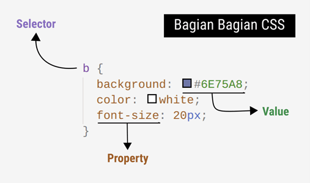

Jika sebelumnya kita sudah mengetahui apa itu HTML maka sekarang kita akan membuat agar tampilan pada website kita tidak berupa kerangka lagi tetapi menjadi lebih bagus lagi untuk dilihat oleh siapapun maka dari itu kita membutuhkan sebuah style menggunakan CSS. CSS (Cascading Style Sheet) merupakan sebuah bahasa yang digunakan untuk mengatur atau mempercantik tampilan website dengan mengatur komponen sesuai yang diinginkan. Ada beberapa cara untuk menerapkan CSS ini kedalam sebuah website yang kita buat yaitu :

- **Internal CSS** merupakan cara penerapan kode css didalam satu file dengan file dokumen webnya yang biasa berada pada tag head dan dibuka dengan tag \<style\>\</style\>.
- **Inline CSS** merupakan cara penerapan kode css didalam sebuah element yang ada pada html dengan menambahkan perintah style="" pada elementnya, contoh \
.
- **External CSS** merupakan cara penerapan kode css dengan file yang terpisah dari file dokumen webnya (HTML). Untuk menerapkan cara ini kita perlu menambahkan link dari file html menuju ke file cssnya dengan memasukan perintah \<link rel="stylesheet" href="./lokasiFile.css"\>.

Beberapa cara diatas tidak membuat kode yang ada di dalamnya berubah juga, hanya cara penerapannya saja yang berbeda. Pada CSS kita bisa mengenal beberapa bagian didalamnya, yaitu selector, property dan value. Selector merupakan sebuah identitas dari element yang diterapkan html yang dimana identitas ini akan dipakai nantinya untuk memanggil komponen tersebut. Cara pemanggilan selectornya kita bisa cukup memanggil elementnya saja dengan memasukan elementnya di css contoh _div{}_ atau bisa juga menggunakan identitas atau attribut class (.) atau id (#) contohnya adalah .navbarClass{} dan #navbarID{}. Didalam kurung kerawal setelah selector terdapat sebuah property dan value. Properti merupakan sebuah identitas dari komponen yang akan di ganti bisa kita sebut sebagai nama jenis style yang akan kita ganti contohnya jika kita ingin mengganti warna text maka kita cukup memanggil style warna tersebut yaitu dengan memanggil _color:_ dan memasukan valuenya yaitu nilai dari style tadi contohnya kita akan merubah warna text menjadi merah maka kita tuliskan kode _color: red;_ dengan aturan penulisan kode yaitu menaruh titik koma diakhir value jika kita ingin menambahkan property baru lagi.

Dalam pembuatan sebuah CSS saya biasanya menggunakan sebuah attribut class atau id. Attribut ini mempermudah kita untuk mengidentifikasi. Perbedaan id dan class yaitu jika kita ingin mengatur banyak element sekaligus kita bisa menggunakan class dan jika hanya ada 1 element maka kita gunakan attribut id. Dalam hal ini kita sebagai programmer disarankan untuk tidak mengulangi kode yang sudah di tulis sebelumnya, maka dari itu kita bisa membuatnya dengan attribut class ini untuk mengeksekusi beberapa element di kode yang sama.