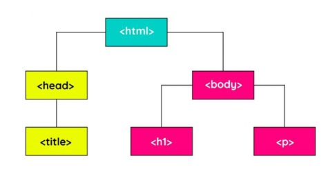
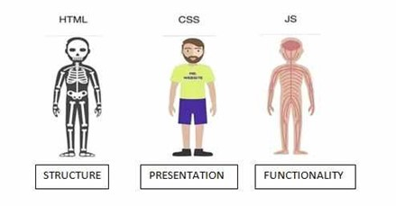
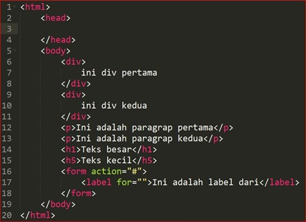

HTML (Hypertext Markup Language) adalah bahasa markup atau bahasa standar yang digunakan untuk membuat sebuah website. HTML merupakan kerangka dari sebuah web yang sudah kita lihat selama ini. HTML memiliki beberapa versi, tetapi versi yang sering kita pakai pada saat ini adalah versi HTML 5. HTML 5 merupakan versi terbaru dari HTML saat ini yanng dimana memiliki beberapa fitur yang bisa kita gunakan contohnya adalah dalam pembuatan sebuah navbar, header, footer, asside dan lainnya tanpa harus mengidentifikasikannya atau mengelompokkannya di sebuah class. Cara penerapannya pada HTML 5 ialah dengan cara menambahkan perintah \<!DOCTYPE HTML\> pada baris awal saat kita membuat kodingan html. Cara penerapan kode di html ialah dengan menambahkan tag pembuka \<element\> dan tag penutup \</element\>.

HTML memiliki beberapa struktur yang sangat penting ialah tag html itu sendiri, tag head dan tag body. Tag html digunakan untuk menginformasikan pada browser bahsa dokumen ini bertipe HTML. Tag head merupakan wadah/tempat kita menaruh informasi-informasi tentang halaman website yang tidak ditampilkan dihalaman browser, contohnya ialah title dan source css/js. Sedangkan untuk tag body merupakan tag yang berisi element-element yang di tampilkan pada halaman website, contohnya adalah paragraf \<p\>.

Dalam sebuah pemrograman web HTML merupakan sebuah kerangka dari sebuah website tersebut dapat kita analogikan di kehidupan sehari-hari yaitu HTML merupakan sebuah tulang yang ada di dalam tubuh manusia. Untuk penulisan kode agar bisa terbaca pada browser kita dapat melakukannya pada tag body yang dimana didalam body terdapat banyak macam element-element sesuai dengan fungsinya masing-masing. Dalam penulisan sebuah tag di HTML kita harus memiliki tag pembuka dan penutup, tetapi tidak semua tag memiliki penutup contohnya ialah tag \ untuk menampilkan gambar dan tag \<br\> yang digunakan untuk break atau membuat baris baru.

Berbagai jenis tag yang ada di HTML memiliki fungsi masing-masing, disini saya akan menyebutkan beberapa tag saja. Tag yang pertama adalah \<p\>\</p\> yang digunakan untuk menampilkan sebuah paragraf yang ada di halaman website kita, tag ini berfungsi untuk menampilkan kalimat-kalimat yang akan kita tampilkan nantinya pada browser. Sedangkan untuk menampilkan sebuah title pada paragraf kita bisa menggunakan tag \<h1\>\</h1\> sampai \<h6\>\</h6\> sesuai dengan kebutuhan, semakin besar nilai headingnya maka semakin kecil pula tulisannya. Lalu di html juga bisa digunakan untuk membuat sebuah list \<li\>\</li\> yang berurut \<ol\>\</ol\> maupun yang tidak berurut \<ul\>\</ul\> dengan cara penulisannya ialah menerapkan aturan listnya terlabih dahulu baru menambahkan tag list didalammnya, contoh : \<ul\>\<li\>\</li\>\</ul\>. Di dalam html juga kita bisa membuat sebuah tabel dengan cara menambahkan tag \<table\>\</table\> untuk menerapkan syntax table di html dan perintah table row atau baris table \<tr\>\</tr\> untuk membuat baris baru pada table dan untuk menambahkan data pada table bisa menggunakan tag \<td\>\</td\> atau \<th\>\</th\> untuk data header. Untuk menampilkan media kita bisa menggunakan fungsi masing-masing tagnya dan di berikan value pada source atau lokasi file yang akan ditampilkan, contohnya adalah \. Sedangkan untuk mengelompokkan data-data dari element html tersebut menjadi 1 bisa menggunakan tag \<div\>\</div\> karena tag ini biasa digunakan untuk mengelompokkan atau membuat grup element menjadi 1 dan disarankan untuk menambahkan sebuah attribut class atau id.

Pada saat penulisan kode pasti akan membuat kita keliru jika kode tersebut sudah mencapai banyak atau bertumpuk. Maka dari itu kita perlu sebuah komentar yang akan membantu kita untuk mengingat atau menambahkan sebuah catatan yang terselip didalam sebuah kodingan tersebut. Sama seperti bahasa lainnya, HTML juga memiliki sebuah komentar yang bisa kita terapkan dengan membukanya menggunakan \<!-- dan ditutup menggunakan --\> maka kalimat apa saja yang ada di dalam tag tersebut tidak akan dibaca sebagai kode program oleh html.