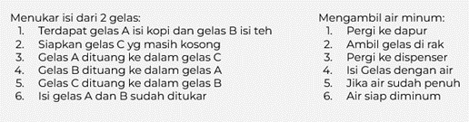
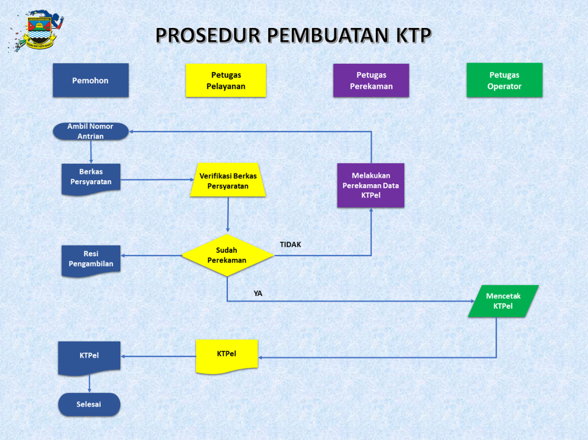
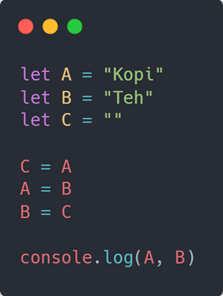

Sebelum kita membuat sebuah program ada kala kita mempelajari atau mengetahui algoritma. Algoritma merupakan hal yang paling penting untuk dilakukan sebelum kita membuat sebuah program. Hal ini juga sudah kita terapkan di kehidupan sehari-hari tanpa kita sadari, contohnya ialah berpakaian. Sebelum menggunakan pakaian kita memiliki alur/proses yang bisa di terapkan yaitu **masuk kekamar -\> membuka lemari -\> memilih pakaian -\> menggunakannya** dan ini adalah termasuk sebuah algoritma di kehidupan sehari-hari. Jadi algoritma adalah sebuah langkah-langkah yang di perlukan untuk menyelesaikan suatu masalah. Proses tersebut dapat dilakukan secara logis dan sistematis. Di dunia programming algoritma sangat penting untuk di pelajari karena dalam menulis sebuah program kita identik dengan memecahkan suatu masalah.

Algoritma memiliki ciri-ciri yaitu input, output, definiteness (pasti), finiteness (batas) dan effectiveness (tepat dan efisien). Sedangkan untuk jenis-jenisnya ialah Sequence, selection, Interaction dan Concurent. Algoritma sendiri biasa di tulis dengan berbagai cara yaitu :

- **Deskriptif**

- **Flowchart**

- **Pseudo Code**

