Untuk melengkapi atau menyempurnakan website yang kita buat kita perlu mempelajari javascript. Javascript adalah sebuah bahasa pemrograman yang sangat powerfull yang digunakan untuk logic sebuah website. Javascript digunakan pada website agar membuat website kita menjadi lebih dinamis dan interaktif. Dengan javascript kita bisa membuat sebuah fungsi-fungsi yang bisa membantu kita untuk menyempurnakan sebuah web yang kita buat contoh yang bisa di buat olehnya ialah sebuah tools maupun game pada web. Javascript merupakan bahasa pemrogaman jenis interpreter sehingga kita tidak memerlukan sebuah compiler untuk menjalankannya. Didalamnya javascript memiliki fitur-fitur seperti berorientasi objek, client-side, programming, loosely typed dan high-level. Javascript tidak hanya digunakan untuk front-end tetapi juga bisa digunakan untuk back-end karena fitur-fitur yang dimilikinya dapat membantu programmer untuk memudahkan hal tersebut contoh saja react js dan express.

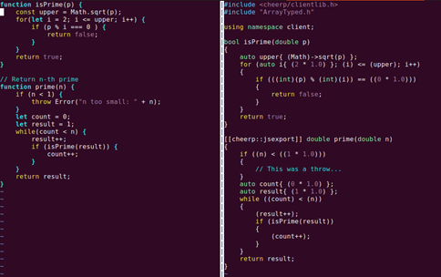

Untuk menjalankan javascript kita bisa menggunakan sebuah browser yang sudah mendukung/support semua fitur javascript contohnya ialah google chrome dan firefox dan juga kita bisa menjalankannya menggunakan Node JS. Tools yang perlu kita persiapkan untuk memulai menjalankan bahasa pemrograman ini bagi pemula ialah web browser, teks editor dan node js. Javascript memiliki beberapa keunggulan dari bahasa pemrograman yang lainnya salah satunya ialah mudah dipahami pemula karena memiliki syntax yang cukup simple untuk diterapkan oleh pemula di bandingkan dengan bahasa pemrograman C++, Java dan lainnya.

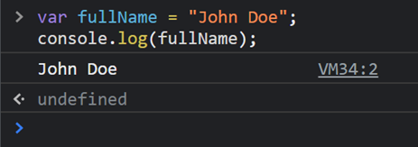

Dalam pembuatan sebuah kode didalam javascript kita dapat mengenal syntax console.log(), syntax tersebut sama fungsinya seperti yang ada di bahasa pemrograman lainnya yaitu untuk mengeluarkan hasil output berupan text ke pada sisi user. Output dari syntax tersebut dapat kita lihat pada browser yaitu dengan masuk ke inspect -\> Console dan bisa juga kita lihat melalui node js jika kita tidak ingin melihatnya di browser dengan cara menjalankan program javascriptnya melalui nodejs. Apa sih contoh dari penggunaan dari javascript pada browser? Contohnya ialah kita bisa menampilkan pesan peringatan kesisi user menggunakan alert(), mengirimkan pesan input menggunakan prompt() dan mengirim pesan konfirmasi menggunakan confirm().

Sama halnya dengan bahasa pemrograman lain, bahasa javascript juga memiliki 6 tipe data yang dapat kita gunakan yaitu :

- **Number** yaitu tipe data yang memiliki hasil berupa angka.
- **String** yaitu tipe data yang memiliki hasil berupa karakter.
- **Boolean** yaitu tipe data yang memiliki dua nilai yaitu true dan false.
- **Null** yaitu tipe data yang tidak memiliki nilai.
- **Underfined** yaitu tipe data yang tidak memiliki nilai atau nilai yang belum di definisikan.
- **Object** yaitu tipe data koleksi dari data yang saling berhubungan dan dapat menyimpan data dengan tipe data yang berbeda. Tipe data ini memiliki key dan value.

Dalam penerapan sebuah tipe data nantinya pasti kita akan menampung tipe data tersebut di dalam sebuah variable. Variable ini berperan sebagai tempat/wadah kita menyimpan nilai-nilai yang akan di simpan berdasarkan tipe data tertentu. Dalam penulisannya di javascript, variable tidak boleh menggunakan karakter spesial, tidak boleh menggunakan spasi spasi, tidak boleh diawali dengan angka atau underscore dan gunakan camelcase untuk penamaan yang lebih dari 1 kata contoh namaPengguna. Javascript memiliki beberapa jenis variable di antaranya ialah :

- **Var** merupakan variable global atau variable yang bisa di akses di seluruh class pada javascript dengan aturan yang sudah di terapkan.
- **Let** merupakan variable lokal atau variable yang hanya bisa di akses di dalam class di tempat variable itu di gunakan.
- **Const** merupakan variable yang nilainya permanen atau tidak bisa diubah.

Tak hanya disitu kita juga harus mengetahui beberapa operator yang di miliki oleh javascript. Operator tersebut hampir sama dengan operator yang ada pada bahasa pemrograman lainnya. Di antaranya ialah :

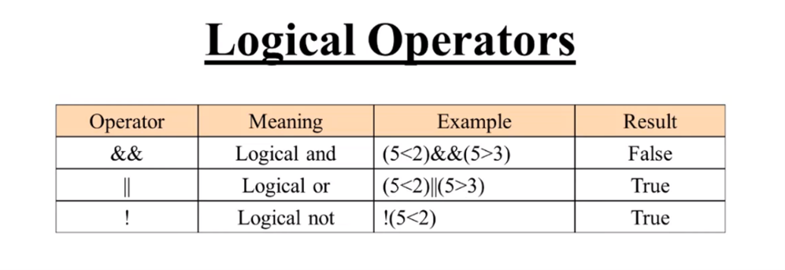

## 

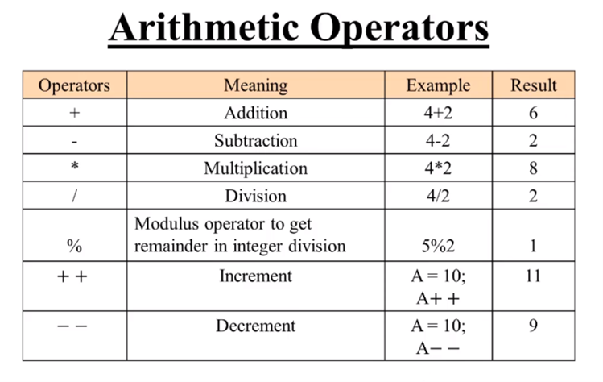

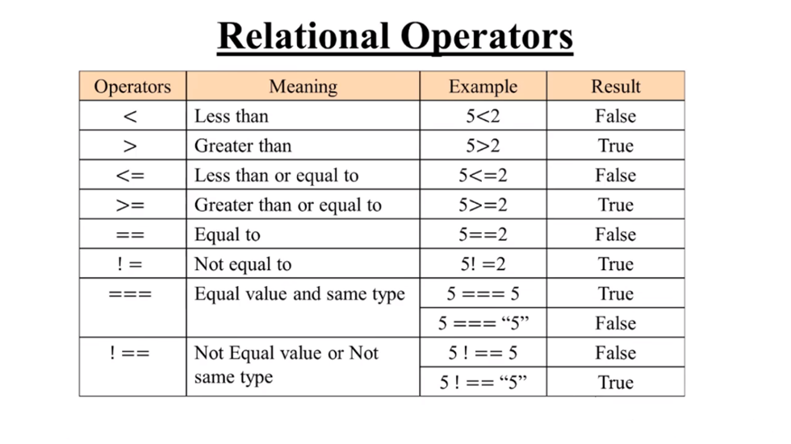

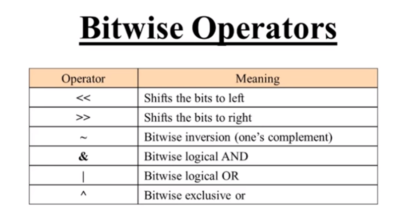

Jika sudah mengenal materi yang sudah di bahas sebelumnya, pasti kita akan bertemu dengan conditional. Conditional merupakan statement percabangan yang menggambarkan suatu kondisi sebelum mengeksekosi perintah yang diberikan. Yang di baca dari conditional ialah nilai boolean yaitu true dan false. Jika nilai bernilai benar maka akan mengeksekusi perintah didalamnya dan jika salah maka akan mengeksekusi perintah sesuai yang ditentukan. Contoh penerapannya ialah if, else if dan else. Dan jika kondisi terlalu banyak maka kita bisa menggunakan perintah swtich case.

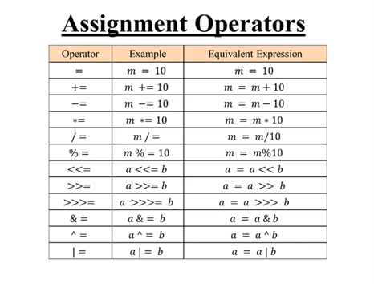

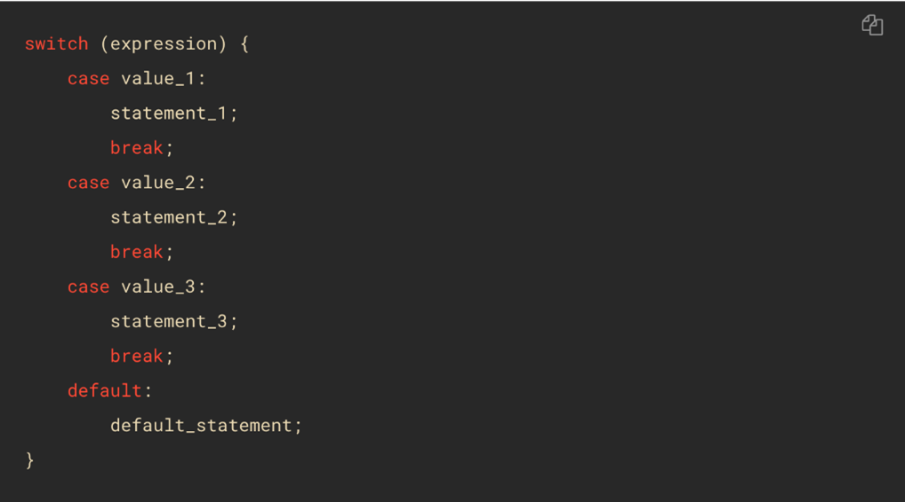

Javascript juga memiliki perintah untuk melakukan perulangan yang biasa disebut dengan looping. Looping adalah statement yang mengulang sebuah instruksi hingga kondisi sudah terpenuhi. Beberapa jenis perulangan yang ada di javascript ialah.

1. **For loop**

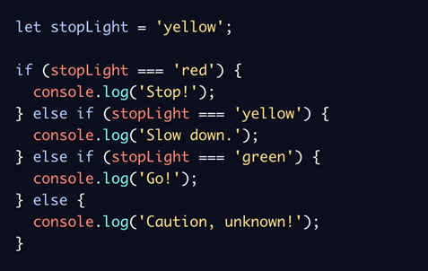

1. **While loop**

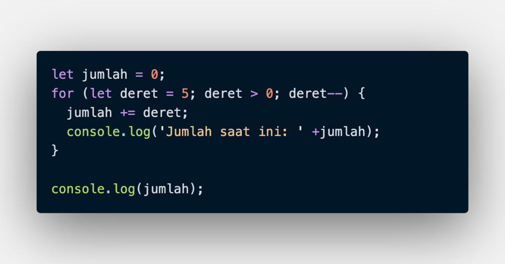

1. **Do while**

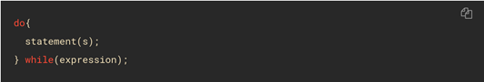

1. **Nested loop (looping didalam looping)**

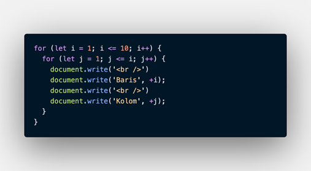